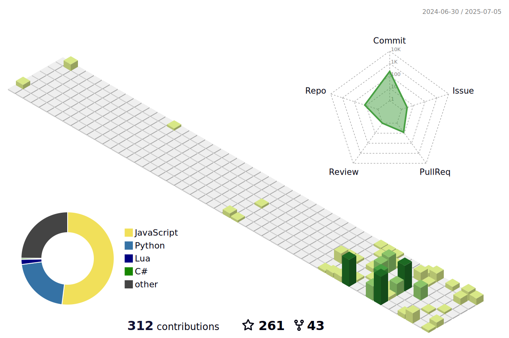

<!--   my-icons -->
<p align="center">
    <a href="https://github.com/qyjoy"></a>
    <a href="https://github.com/python/cpython"></a>
    <a href="https://github.com/qyjoy/qyjoy/graphs/contributors"></a>
    <a href="https://github.com/qyjoy/qyjoy/stargazers"></a>
    <a href="https://github.com/qyjoy/qyjoy/network/members"></a>
    
</p>

<!--   my-header-img -->


<!--   my-ticker -->    
[](https://github.com/DenverCoder1/readme-typing-svg)

| **Skill / Area**             | **Details**                                                                                                                                                                                                                                                                                                                                                                                                                                                                                                                                                                                                                                                                                                                                                                                                                                                                                                                                     |
|------------------------------|-------------------------------------------------------------------------------------------------------------------------------------------------------------------------------------------------------------------------------------------------------------------------------------------------------------------------------------------------------------------------------------------------------------------------------------------------------------------------------------------------------------------------------------------------------------------------------------------------------------------------------------------------------------------------------------------------------------------------------------------------------------------------------------------------------------------------------------------------------------------------------------------------------------------------------------------|
| **Language / IDE**           | &nbsp;&nbsp;&nbsp;&nbsp;&nbsp;&nbsp;&nbsp;&nbsp;&nbsp; |
| **Domain Knowledge**         | [](https://github.com/search?q=user%3Aqyjoy&type=Repositories) [](https://github.com/search?q=user%3Aqyjoy&type=Repositories) [](https://github.com/search?q=user%3Aqyjoy&type=Repositories) [](https://en.wikipedia.org/wiki/Semiconductor_device) |
| **CI / CD**                  | [](https://github.com/qyjoy/qyjoy) &nbsp; &nbsp; &nbsp; [](https://www.docker.com) [](https://code.visualstudio.com) |
| **Databases**                | &nbsp; &nbsp; [](#)|
| **Artificial Intelligence & Machine Learning** |    [](#) [](#) [](#)  |

<!--   GitHub stats graph -->
### 📈 GitHub Activity Graph:
<!--   green snake -->

<!--   stats + languages -->
|  |  |
|-----------------------------------------------------------------------------------------------------------------------------------------|---------------------------------------------------------------------------------------------------------------------------|
|  |  |
| </img>                                                           |     <p align="center"></p> |
<!-- dark snake -->

<!--   profile-green-animate -->


<div align="center">
<summary>Trophy: Github Profile Trophy</summary>
</div>

<p align="center"> 
<a href="https://github.com/ryo-ma/github-profile-trophy"></a>
</p>

```mermaid
graph TD;
    %% Computer Science
    Computer_Science["Computer Science"] --> Programming_Concepts["Programming Concepts"]
    Computer_Science --> Algorithm_Design_and_Analysis["Algorithm Design and Analysis"]
    Computer_Science --> Discrete_Mathematics["Discrete Mathematics"]
    Computer_Science --> Compiler_Principles["Compiler Principles"]
    Computer_Science --> Data_Structures_and_Algorithms["Data Structures and Algorithms"]
    Computer_Science --> Computer_Architecture["Computer Architecture"]
    Computer_Science --> Operating_Systems["Operating Systems"]
    Computer_Science --> Python["Python"]
    Computer_Science --> Java_OOP["Java Object-Oriented Programming"]
    Computer_Science --> Advanced_Java["Advanced Java Programming"]
    Computer_Science --> Java_GUI["Java GUI Programming"]
    Computer_Science --> Cpp_Programming["C++ Programming"]
    Computer_Science --> Chineseprogramming["Chinese E programming"]
    Computer_Science --> Code_Audit["Code Audit"]
    Computer_Science --> Artificial_Intelligence["Artificial Intelligence"]
    Computer_Science --> Machine_Learning["Machine Learning"]
    Computer_Science --> High_Performance_Computing["High Performance Computing"]

    %% Networking
    Networking --> Network_Principles["Network Principles"]
    Networking --> Computer_Network_and_Communication["Computer Network and Communication"]
    Networking --> Java_Network_Programming["Java Network Programming"]
    Networking --> Enterprise_Network_Management["Enterprise Network Management"]
    Networking --> SDN["SDN"]
    Networking --> Wireless_Networking["Wireless Networking"]
    Networking --> Internet_of_Things["Internet of Things"]
    Networking --> Network_Security["Network Security"]
    Networking --> Distributed_Systems["Distributed Systems"]
    Distributed_Systems --> Cloud_Computing["Cloud Computing"]
    Distributed_Systems --> Fog_Computing["Fog Computing"]
    Distributed_Systems --> Edge_Computing["Edge Computing"]

    %% Software
    Software --> Software_Craftsmanship["Software Craftsmanship"]
    Software --> Software_Engineering["Software Engineering"]
    Software --> Software_Requirements_Engineering["Software Requirements Engineering"]
    Software --> UI_Design["UI Design"]

    %% Hardware
    Hardware --> Semiconductor_Engineering["Semiconductor Engineering"]
    Hardware --> Computer_Organization["Computer Organization"]
    Hardware --> Embedded_Systems["Embedded Systems"]
    Hardware --> Chip_Security["Chip Security"]

    %% Graphics
    Graphics --> Graphics_Algorithms["Graphics Algorithms"]
    Graphics --> YOLO["YOLO"]
    Graphics --> Computer_Vision["Computer Vision"]

    %% Data
    Data --> Deep_Data_Mining["Deep Data Mining"]
    Data --> Big_Data["Big Data"]
    Data --> Computational_Statistics["Computational Statistics"]
    Data --> Parallel_Computing["Parallel Computing"]
    Data --> Tensor_Computing["Tensor Computing"]
    Data --> Database_Principles["Database Principles"]
    Database_Principles --> Oracle_SQL["Oracle SQL"]
    Database_Principles --> MySQL["MySQL"]

    %% General Academic Skills
    General_Academic_Skills["General Academic Skills"] --> Academic_Writing["Academic Writing"]
    General_Academic_Skills --> Academic_Presentation["Academic Presentation"]
    General_Academic_Skills --> IELTS_English["IELTS English"]
    General_Academic_Skills --> TOEFL_English["TOEFL English"]
    General_Academic_Skills --> PTE_Academic_English["PTE Academic English"]
    General_Academic_Skills --> American_Slang["American Slang"]
    General_Academic_Skills --> Basic_Russian["Basic Russian"]
    General_Academic_Skills --> Basic_Malay["Basic Malay"]

    %% Self-Exploration
    Self_Exploration["Self-Exploration"] --> Shell["Shell"]
    Self_Exploration --> Lua["Lua"]
    Self_Exploration --> MCP["MCP"]
    Self_Exploration --> A2A["A2A"]
    Self_Exploration --> Cloudflare_Worker["Cloudflare Worker"]
    Self_Exploration --> ThreeD_Modeling["3D Modeling"]
    Self_Exploration --> Game_Anti_Cheat["Game Anti cheat"]
    Self_Exploration --> Game_Development["Game Development"]
    Self_Exploration --> Advanced_Video_Editing["Advanced Video Editing"]

    %% Sports
    Sports --> Volleyball["Volleyball"]
    Sports --> Swimming["Swimming"]
    Sports --> Badminton["Badminton"]
  ```

</p>

<p align="center" style="max-height:2950px;overflow:hidden;">
  
</p>

<details>
<summary><b>✨ Click to view my Social Media ✨</b></summary>

<p align="center">
  <a href="https://www.youtube.com/@QingYinJoy" target="_blank">
    
  </a>
  <a href="https://dlink.host/sharepoint/aHR0cHM6Ly80YzJ4ZHQtbXkuc2hhcmVwb2ludC5jb20vOmk6L2cvcGVyc29uYWwvYWRtaW5fNGMyeGR0X29ubWljcm9zb2Z0X2NvbS9FZkhESkJHOV9fTkVzdnVMWmF5LV9ac0I2VUlXNnA0NDdEYXFxRE1FQmQ4VFl3P2U9T2Jjc1JC.png" target="_blank">
    
  </a>
  <a href="https://discord.gg/MuWYY47Ftk" target="_blank">
    
  </a>
  <a href="https://www.douyin.com/user/MS4wLjABAAAAnSML_sObNCsyovRMZcRleFAvWCy_c11yR-cCbEW8zHva71o2FcxaQBW5og4mqUc-" target="_blank">
    
  </a>
  <a href="https://space.bilibili.com/3546374788352322" target="_blank">
    
  </a>
  <a href="https://music.163.com/artist?id=96130566" target="_blank">
    
  </a>
</p>

</details>


#### Thanks for visiting :heart:
<p align="center"> 
  

counting of visitors to this page in this section started from May 8, 2022
<a href="http://s01.flagcounter.com/more/ap7"></a>


## Star History

[](https://star-history.com/#qyjoy/qyjoy&Date)


### Profile Views
counting of visitors to this page in this section started from June 12, 2022


</br>

[MIT](LICENSE)
</p>
*If you liked my profile, you can Star ⭐ the repo and if you want to use this template you can Fork it and can use.* 

[For future hacker...](https://https://radar.cloudflare.com)

